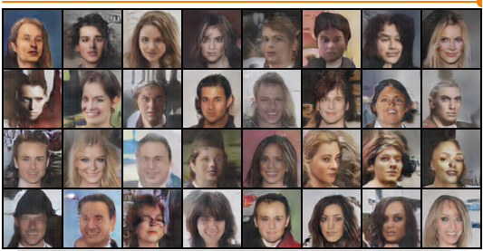

# Generative Advarsial Network DCGAN
In recent years, supervised learning with convolutional networks (CNNs) has seen huge adoption in computer vision applications. Comparatively, unsupervised learning with CNNs has received less attention. In this work we hope to help bridge the gap between the success of CNNs for supervised learning and unsupervised learning. We introduce a class of CNNs called deep convolutional generative adversarial networks (DCGANs), that have certain architectural constraints, and demonstrate that they are a strong candidate for unsupervised learning. Training on various image datasets, we show convincing evidence that our deep convolutional adversarial pair learns a hierarchy of representations from object parts to scenes in both the generator and discriminator. Additionally, we use the learned features for novel tasks - demonstrating their applicability as general image representations.

## How its work
after adding your custom data to model (change data loader) you can train model by train.py to get wights which make you able to generate new images using generate.py with any number of new examples.

## Train

```bash
!python train.py --img_size 64 --num_channels 3 --epochs 5 --batch_size 128 --z_dim 100 --data_path "/content/img_align_celeba/"
```
## Usage

```bash
!python generate.py --nums 10 --path /content/weights.pt --z_dim 100 --num_channels 3 --img_size 64
```
## Generated Samples
<p align="center">
    
</p>

