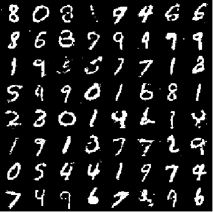

# Generative Advarsial Network MLP
We propose a new framework for estimating generative models via an adversarial process, in which we simultaneously train two models: a generative model G that captures the data distribution, and a discriminative model D that estimates the probability that a sample came from the training data rather than G. The training procedure for G is to maximize the probability of D making a mistake. This framework corresponds to a minimax two-player game. In the space of arbitrary functions G and D, a unique solution exists, with G recovering the training data distribution and D equal to 1/2 everywhere. In the case where G and D are defined by multilayer perceptrons, the entire system can be trained with backpropagation. There is no need for any Markov chains or unrolled approximate inference networks during either training or generation of samples. Experiments demonstrate the potential of the framework through qualitative and quantitative evaluation of the generated samples.

## How its work
after adding your custom data to model (change data loader) you can train model by train.py to get wights which make you able to generate new images using generate.py with any number of new examples.

## Train

```bash
python train.py
```
## Usage

```bash
python generate.py --weights.pt --nums 200
```
## Generated Samples
<p align="center">
    
</p>
